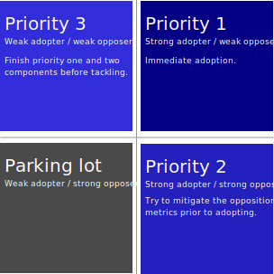
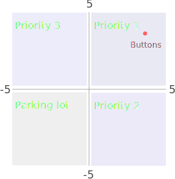

Before you build anything tangible you should start by defining your design principles.

### Design Principles

Design principles are the grounding values and principles which drive the creation of your products.

Atlassian's design principles are "bold, optimistic, and practical."

Design principles must support the global vision of your product and express its identity. What do you want your users to feel when using your product?

Once we've defined our design principles, we're ready for a UI audit.

### UI Audit

Most of us are not working on a brand new product; often there is legacy code and UI to handle. This is where a UI audit comes in.

Take screenshots of all components in your products, in each state and group them visually in one location by functionality.

We're not grouping by visual similarity but by functionality because visual design patterns evolve, but the underlying behavior remains.

Aggregate all components in one place, whether it's a Sketch or Figma file, or a Google doc.

Next, we prioritize.

Which components will have the highest impact on the unification of your product? How feasible is this component to build? Prioritize the highest-impact and highest-feasibility elements first.

Product, design, and engineering should answer questions which evaluate whether or not this design system change should be accepted, and if so, how it should be prioritized.

We need to examine the impact of incorporating this change from a multitude of vantage points.

Some questions you may want to ask are:

- Does this request embody our design principles?
- Does this requires require a lot of design/development effort?
- Does this request come with a high risk to the success of our product?
- Does this request coincide with our product roadmap?
- Does this request require a lot of maintenance?
- Does this request improve the user experience of our products?
- Are we confident in this request or will it need to be revisited again in the near future?
- Is this request technically feasible?

We can take these questions and turn them into impact statements.

These impact statements will coincide with one of six metrics. We can do this by creating impact statements with regards to three adoption metrics and three opposition metrics.

The adoption metrics are: impact, identity, and confidence.

The opposition metrics are: maintenance, risk, and effort.

In order to determine whether we should incorporate this change or component into our design system, we must evaluate the benefits of employing this change against the negatives.

Product, design, and engineering will evaluate this proposal by rating the change against the impact statements.

Once all surveys have been taken, we can average the responses from the adoption metrics and the responses from the opposition metrics, and turn them into x and y coordinates.

Finally can take this request and plot it within our four-quadrant graph.

Let's take an example of a button. We already know that buttons require a ton of effort and maintenance, however the benefits are huge. Since buttons are the most widely-used components in web applications we can be sure they will go a long way towards unifying the brand identity of our application.

Let's suppose we've run the surveys and calculated the mean for both adopter and opposer metrics and we get a score of (4,4) on a 5-point axis for buttons.

Now let's take a composite component, like an accordion. Accordions won't provide much benefit to our product as they're used once or maybe twice throughout the product. But they require a lot of effort and maintenance.

Given these two components, we can see that we should prioritze our button component above our accordion component because it will provide the most benefit.
