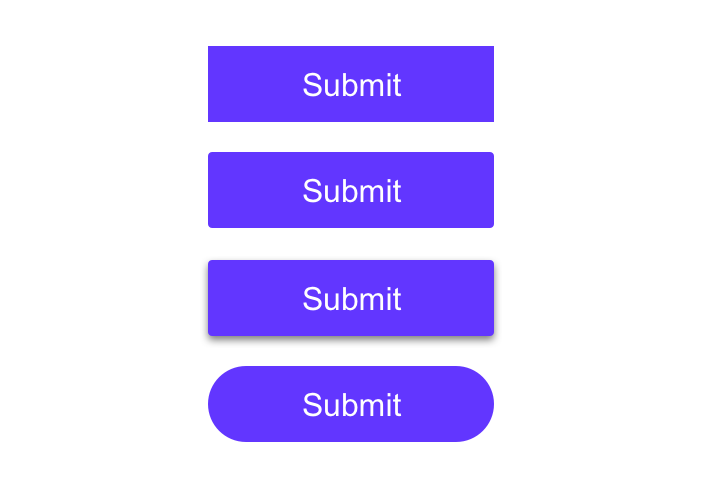
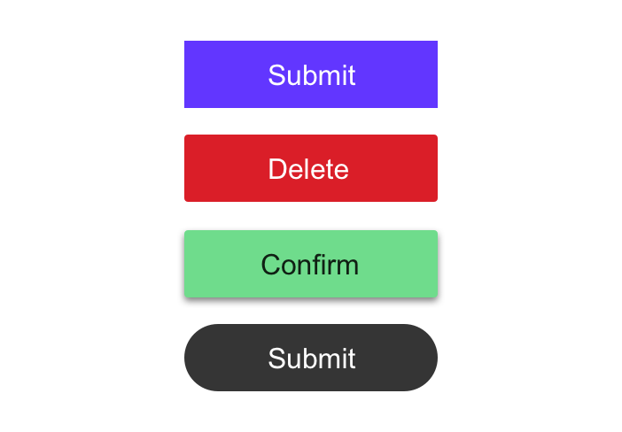
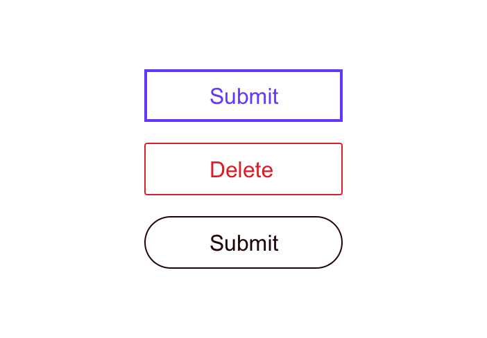
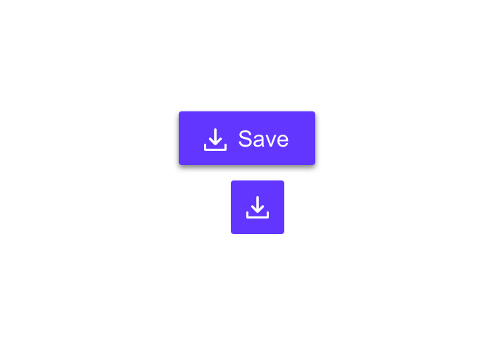
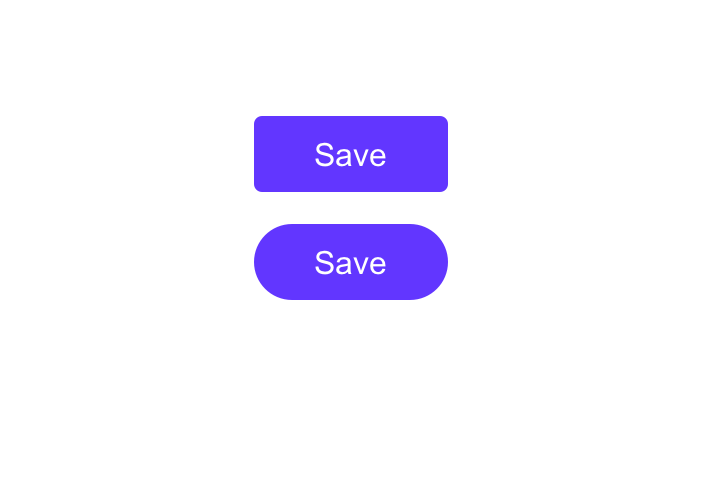
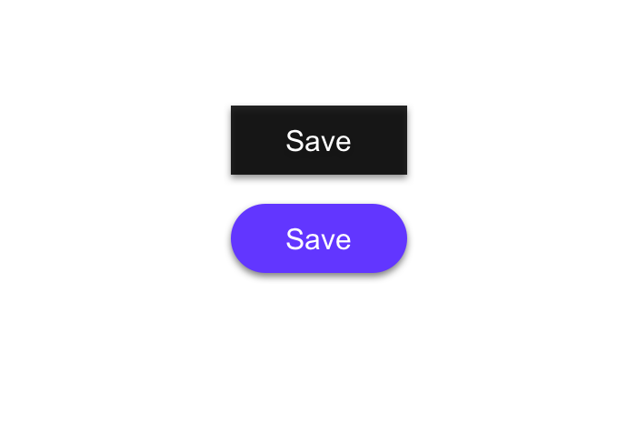
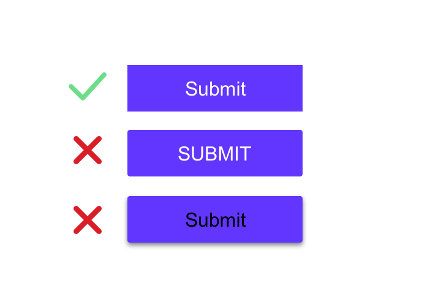
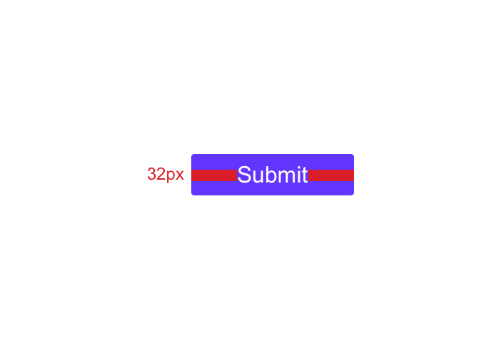

There are many styles you can use to convey your button hierarchy. Your buttons should look and function like a button. Here are some common button patterns which are familiar to most users.

### Solid Buttons

Solid buttons are buttons with a solid background fill. They're easily recognizable and a great choice for a primary button.

### Line / Ghost Buttons

Ghost buttons are buttons without a background fill; they only have an outline.

### Icon Buttons

Icon buttons have no label and are only an icon. Keep in mind that buttons and icons without a label are bad for accessibility and if a label can be used it should.

However, if you do choose to forgo the label, be sure to include an `aria-label` attribute on the button explaining the action that will be completed when triggered and not an explanation of what the icon is.

## Button Styles

### Border Radius

You may choose to have a button with 90 degree squared edges, a partial border-radius, or a full border-radius and it will impact your brand identity.

Rounded buttons are more playful than buttons with squared edges. Your button design should coincide with your brand identity.

### Drop Shadow

You may also choose to add a drop shadow to your button which will elevate it off the page. You can add a drop shadow, or box shadow, to a button on hover or focus as well.

### Label Style

When choosing your label style, be sure you place readability above all else. While uppercase-text buttons look modern, they are often harder for users to read, so you should choose sentence-case over uppercase.

You also need to ensure that you have sufficient color contrast between the label and the button.

Lastly, use a font-weight which is legible.

### Vertical Padding

You must ensure your buttons are large enough to be accessible and clickable on a mobile device. Instead of stating a hard-coded height for your button, add vertical padding. This will allow the browser to change the text size (for visually impaired users) without cutting off the text.

Vertical padding of `16px` is a great option for a large button, `8px` for a default button, and `4px` for a small button.

### Horizontal Padding

To keep your buttons responsive, you can add horizontal padding. You can additionally add a `min-width` property so you don't get tiny buttons.

For example, `32px` of padding on the left and right side of the button with a `min-width` of `100px` is a great option.

