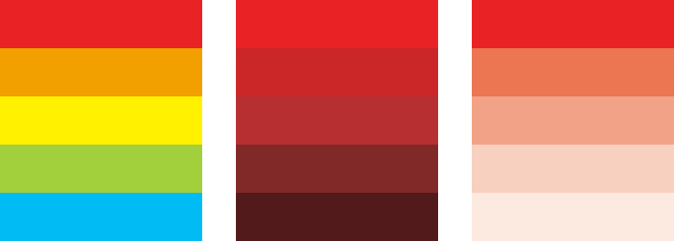

[View the source](http://bit.ly/2TE2aag)

#### Hue

A hue is any color on the color wheel. Variations on this hue are created by establishing a shade, tint, or tone.

#### Saturation

Saturation is the intensity or purity of a color.

#### Luminance

Luminance is the amount of brightness, or light, in a color.

#### Shade

A shade is created by incorporating black to a base hue, which darkens the color.

[View the source](http://bit.ly/2TE2aag)

#### Tint

A tint is created by adding white to a base hue, which lightens the color.

[View the source](http://bit.ly/2TE2aag)

#### Tone

A tone is created by combining black or white (gray) with a base hue. Tones are subtle variations of the original color.

[View the source](http://bit.ly/2TE2aag)
