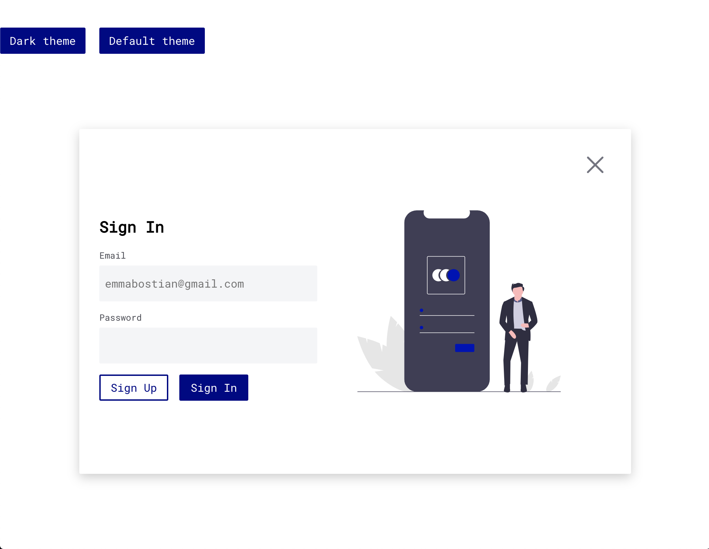

I first downloaded my Sign In illustration as an SVG and added to the `assets/illustrations` folder. Because it's a simple SVG file we don't have to add it to the exports in `index.js`.

Next inside `Modals.js` I imported both text fields, secondary button and the sign in illustration.

```jsx
import { CloseIcon } from "../assets";
import { PrimaryButton, SecondaryButton } from "./Buttons";
import { EmailInput, PasswordInput } from "./TextFields";
```

I refactored `SignUpHeader` to be `ModalHeader` so it's more extensible, and updated the respective JSX tags.

```jsx
const ModalHeader = styled.h3`
  font-size: ${typeScale.header3};
`;

...

<ModalHeader>Sign Up</ModalHeader>
```

Next I created the `SignInModal` component. I need a two-column layout so I created a new `ModalWrapper`.

```jsx
const ColumnModalWrapper = styled(ModalWrapper)`
  flex-direction: row;
  justify-content: space-around;
`;
```

```jsx
export const SignInModal = () => (
  <ColumnModalWrapper>
    <div>
      <ModalHeader>Sign In</ModalHeader>
      <EmailInput label="Email" placeholder="emmabostian@gmail.com" />
      <PasswordInput label="Password" />
      <SecondaryButton style={{ margin: "16px 16px 0 0" }}>
        Sign Up
      </SecondaryButton>
      <PrimaryButton>Sign In</PrimaryButton>
    </div>
    
    <CloseModalButton onClick={() => console.log("You closed the modal!")}>
      <CloseIcon />
    </CloseModalButton>
  </ColumnModalWrapper>
);
```

You can import this to `index.js` and test it out!



---

If you're lost or missed some code, you can check out the branch `step-1-styled-components` on the [GitHub repo](https://github.com/emmabostian/fem-design-systems)!
