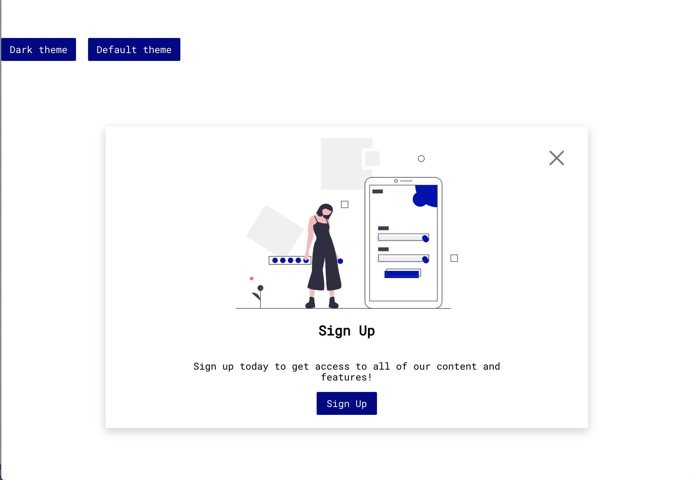

Now we're ready to create our first composite component! Create a new file `Modal.js` inside of the `components/` folder.

Additionally, create an `index.js` file and let's export all components from `Buttons.js` and `Modals.js`.

```jsx
export * from "./Buttons";
export * from "./Modals";
```

Now we will be able to import components from `/components` instead of `/components/Buttons` or `/components/Modals`. You can update `index.js` accordingly.

### Adding An Illustration

First let's add our illustration. Export the illustration from Figma as an SVG.

Inside of `src/` create an `assets/` folder and inside add an `illustrations/` folder.

Save your SVG in a file called `SignUp.svg` and add it to the `illustrations` folder.

Let's also create an `index.js` file inside of the `assets` folder and export our newly added illustration.

```jsx
export const Illustrations = {
  SignUp
};
```

Let's also add a new variable to our themes `formElementBackground`.

For light theme we'll use `neutral[100]` and for dark theme we'll use `blue[100]`. `blue[100]` isn't necessarily the best background color for the dark-theme modal, but I just want to illustrate the state change. You're welcome to use whichever values you like.

We'll also need a `textOnFormElementBackground` variable which will be `neutral[600]` for the default theme and `neutral[100]` for the dark theme.

```jsx
// Default theme
formElementBackground: neutral[100],
textOnFormElementBackground: neutral[600],

// Dark theme
formElementBackground: blue[100],
textOnFormElementBackground: neutral[100],
```

Inside of `Modals.js` let's import `React` as well as `styled-components`.

```jsx
import React from "react";
import styled from "styled-components";
```

First let's create our modal wrapper which will contain all of the styling for our modal.

```jsx
const ModalWrapper = styled.div`
  width: 800px;
  height: 500px;
  box-shadow: 0 5px 16px rgba(0, 0, 0, 0.2);
  background-color: ${props => props.theme.formElementBackground};
  color: ${props => props.theme.textOnFormElementBackground};
  display: flex;
  flex-direction: column;
  justify-content: center;
  align-items: center;
  position: relative;
  border-radius: 2px;
  background: ${props => props.theme.formElementBackground};
`;
```

Next, let's create the sign up header and sign up content as styled components. They will both use our type scale.

First import the `typeScale` variable then add it to the following declarations.

```jsx
import { typeScale } from "../utils";
```

```jsx
const SignUpHeader = styled.h3`
  font-size: ${typeScale.header3};
`;

const SignUpText = styled.p`
  font-size: ${typeScale.paragraph};
  max-width: 70%;
  text-align: center;
`;
```

Now let's create a `SignUpModal` which inherits from `ModalWrapper`. This will allow us to be very explicit with our component imports `<SignUpModal />`.

You can of course create a basic `Modal` element and add children inside, which is great to encapsulate logic closer to where it's being used, but for the sake of this tutorial let's create the sign up modal inside of the `Modals` file.

Don't forget to import `PrimaryButton` so we can use it in our modal. You can use the default or the named export. We'll also need our `SignUp.svg` illustration.

```jsx
import { PrimaryButton } from "./Buttons";
import { Illustrations } from "../assets";
```

```jsx
export const SignUpModal = () => {
  return (
    <ModalWrapper>
      
      <SignUpHeader>Sign Up</SignUpHeader>
      <SignUpText>
        Sign up today to get access to all of our content and features!
      </SignUpText>
      <PrimaryButton onClick={() => console.log("You signed up!")}>
        Sign Up
      </PrimaryButton>
    </ModalWrapper>
  );
};
```

Now let's add our close icon. We can export it as an SVG from Figma and create a new file `CloseIcon.js` inside of our assets folder. Create a new folder `icons/` inside of `assets/` and place `CloseIcon.js` inside.

Let's make `CloseIconWrapper` a styled component so we can set some styling on it.

```jsx
import React from "react";
import styled from "styled-components";

const CloseIconWrapper = styled.svg`
  width: 100%;
  height: 100%;
`;

export const CloseIcon = () => (
  <CloseIconWrapper aria-hidden="true">...</CloseIconWrapper>
);
```

**You should only use inline-SVG for elements whose properties will be changing in response to user interaction (i.e. hover, focus). For static SVG elements, like our illustration, you should use `` to reduce file bloat.**

Now let's export `CloseIcon` from the assets `index.js`.

```jsx
export * from "./icons/CloseIcon";
```

We can import `CloseIcon` and our illustrations into `Modals.js` and use it in our `SignUpModal` component.

```jsx
import { Illustrations, CloseIcon } from "../assets";
```

Now let's create a button which will wrap the `CloseIcon`. Then we'll instantiate the icon inside of the button.

```jsx
import { SignUp, CloseIcon } from "../assets";

...
const CloseModalButton = styled.button`
  cursor: pointer;
  background: none;
  border: none;
  position: absolute;
  top: 40px;
  right: 40px;
  width: 24px;
  height: 24px;
  padding: 0;
`;

export const SignUpModal = () => {
  return (
  <ModalWrapper>
    ...
    <CloseModalButton aria-label="Close modal" onClick={() => console.log("You closed the modal!")}>
      <CloseIcon />
    </CloseModalButton>
  </ModalWrapper>
  );
};
```

If we head back to `index.js` we can import `SignUpModal` and instantiate it.

```jsx
import { SignUpModal } from "./components";

...

<SignUpModal />
```



Now build your second Figma modal which you designed in the last chapter.

For the text fields, you can grab the code in the [course GitHub repository](https://github.com/emmabostian/fem-design-systems/blob/master/src/components/TextFields.js).
