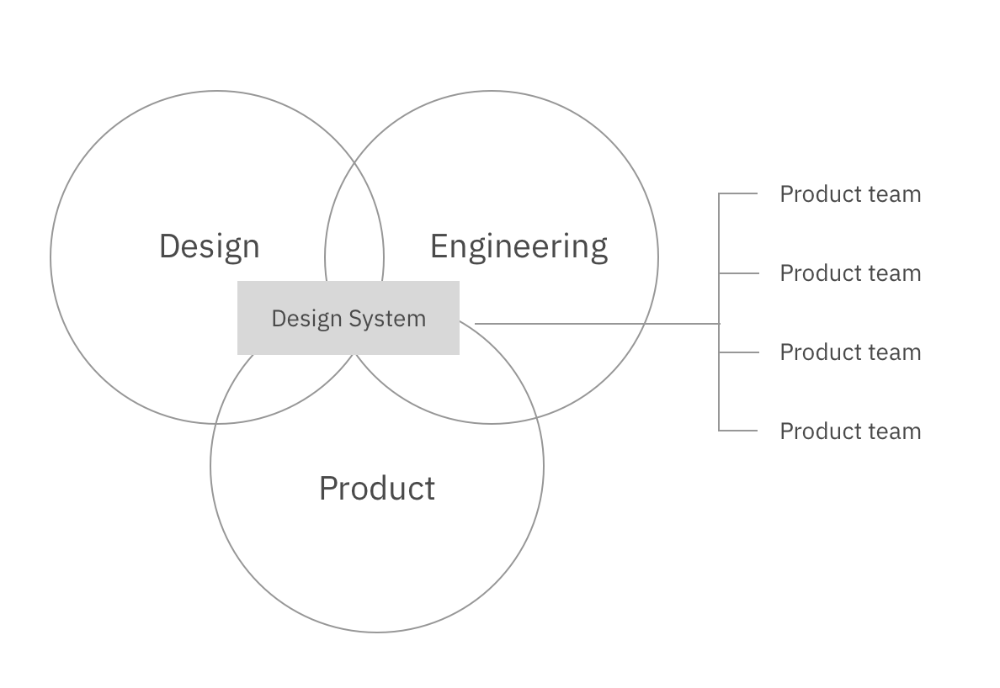
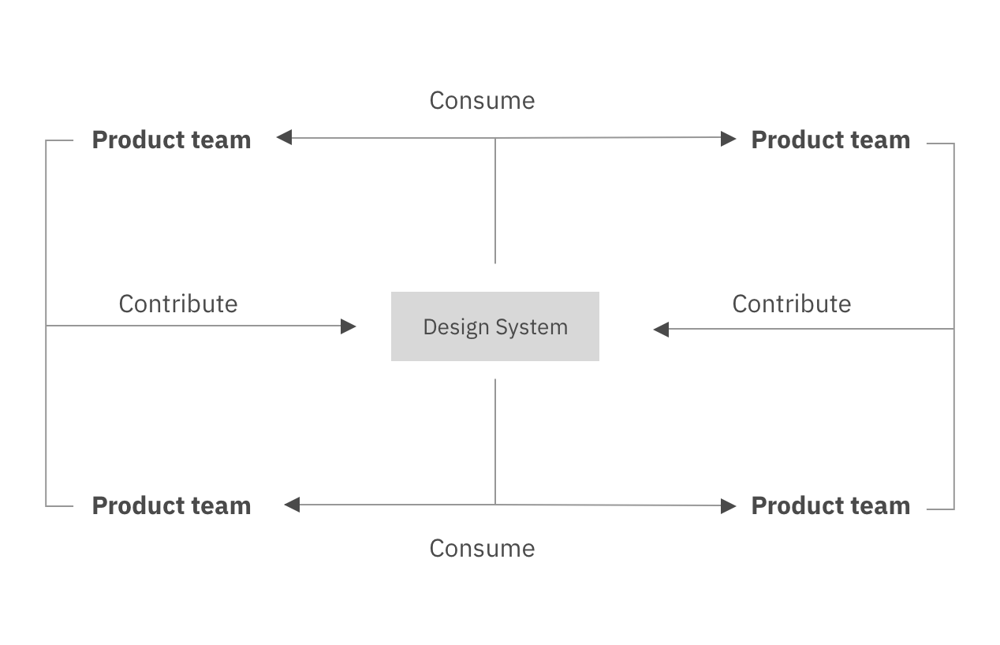
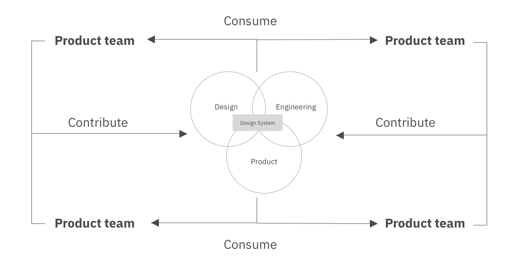

There are three different team-structures with which you can build a design system and hopefully promote adoption.

### Centralized Model

The first type of team structure is the centralized model. A core group of members are autonomous in running and maintaining the design system.

They will

- Define the foundation & identity of the system
- Have veto power over the system
- Manage & create the UI Kit, component library, and style guide

The team structure is cross-disciplined. You'll need members from design, engineering, and product in order to build a sustainable and scalable system.

### Distributed Model

In contrast, we have the distributed model which doesn't leverage a core team, but instead is built and maintained by the teams using the system itself.

The distributed model instills a sense of ownership within all contributing design system members. And people are more passionate about something when they have a hand in creating it.

Additionally, the system will be influenced by many different vantage points leading to more collaboration and potentially more innovation.

Finally, as it's being built by the teams using it, progress doesn't stop if one core member is unavailable.

In this team model we can see that there is no centralized or core team building the system; the teams which consume the system are simultaneously contributing to the system.

### Hybrid Model

Lastly is the hybrid model, which combines the centralized and distributed team models.

This method is the most effective as decisions are made quickly and development of the design system is streamlined due to community contribution.

