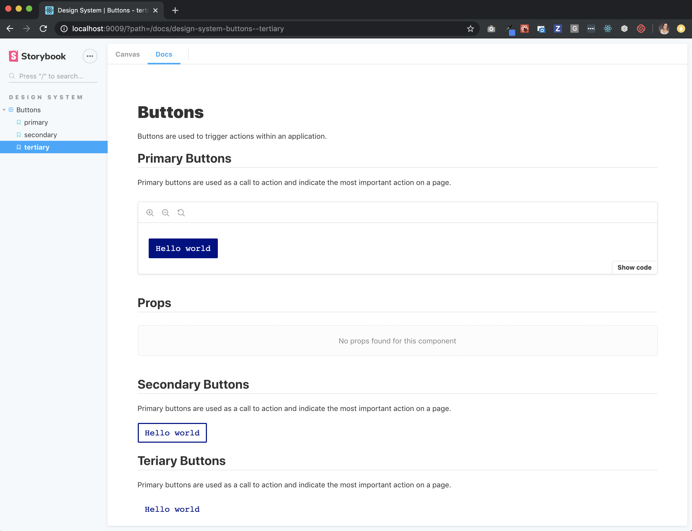

At the moment, Storybook is unaware of our theme, so our components aren't rendering with the correct styling.

To pass the theme prop to our components we have to do a bit of configuration.

First install two add-ons: background and contexts.

```
npm i -D @storybook/addon-backgrounds @storybook/addon-contexts
```

Next, add the two add-ons to the addons array in `main.js`.

```js
module.exports = {
  stories: ["../src/**/*.stories.(js|mdx)"],
  addons: [
    "@storybook/preset-create-react-app",
    "@storybook/addon-docs",
    "@storybook/addon-contexts/register",
    "@storybook/addon-backgrounds/register"
  ]
};
```

Now let's create a new file, `contexts.js` inside of the `.storybook` directory and add the following.

```js
import { ThemeProvider } from "styled-components";
import { defaultTheme, darkTheme } from "../src/utils";

export const contexts = [
  {
    icon: "box", // a icon displayed in the Storybook toolbar to control contextual props
    title: "Themes", // an unique name of a contextual environment
    components: [ThemeProvider],
    params: [
      // an array of params contains a set of predefined `props` for `components`
      { name: "Default Theme", props: { theme: defaultTheme, default: true } },
      { name: "Dark Theme", props: { theme: darkTheme } }
    ],
    options: {
      deep: true, // pass the `props` deeply into all wrapping components
      disable: false, // disable this contextual environment completely
      cancelable: false // allow this contextual environment to be opt-out optionally in toolbar
    }
  }
];
```

Now that we have our context, our themes, we have to tell Storybook about it. Create a new file inside of the `.storybook` directory called `preview.js`.

```js
import { addParameters } from "@storybook/react";
import { addDecorator } from "@storybook/react";
import { withContexts } from "@storybook/addon-contexts/react";
import { contexts } from "./contexts";

addParameters({
  backgrounds: [
    { name: "Default theme", value: "#ffffff", default: true },
    { name: "Dark theme", value: "#050449" }
  ]
});

addDecorator(withContexts(contexts));
```

Now if we restart our Storybook server, we should see our buttons rendering in the UI. We also have a Docs tab which houses all of our documentation.


